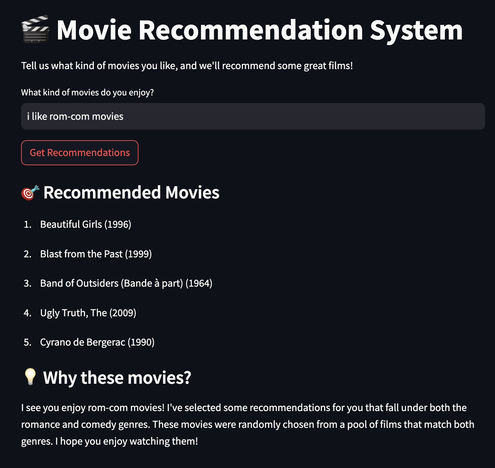

# 🎬 Movie Recommendation System

An intelligent movie recommendation system that uses natural language processing and graph databases to provide personalized movie suggestions based on user preferences.



## 🌟 Features

- Natural language understanding of movie preferences
- Personalized movie recommendations based on user input
- Detailed explanations for why movies are recommended
- Interactive web interface built with Streamlit
- Powered by Neo4j graph database for efficient movie data storage and retrieval
- Advanced AI agents using LangChain and LangGraph for intelligent recommendation generation

## 🚀 Getting Started

### Prerequisites

- Python 3.8 or higher
- Neo4j Database
- OpenAI API key

### Installation

1. Clone the repository:

```bash
git clone https://github.com/yourusername/movie-recommender.git
cd movie-recommender
```

2. Install the required dependencies:

```bash
pip install -r requirements.txt
```

3. Set up your environment variables:
   Create a `.env` file in the root directory with the following variables:

```
NEO4J_URI=your_neo4j_uri
NEO4J_USER=your_neo4j_username
NEO4J_PASSWORD=your_neo4j_password
OPENAI_API_KEY=your_openai_api_key
```

### Running the Application

1. Start the Streamlit application:

```bash
streamlit run src/main.py
```

2. Open your web browser and navigate to `http://localhost:8501`

## 💡 Usage

1. Enter your movie preferences in natural language (e.g., "I like sci-fi and action movies" or "I enjoy comedy and crime films")
2. Click "Get Recommendations"
3. View your personalized movie recommendations along with explanations

## 🏗️ Project Structure

```
movie-recommender/
├── src/
│   └── movie_recommender/
│       ├── agents/         # AI agents for recommendation generation
│       ├── ui/            # Streamlit web interface
│       └── utils/         # Utility functions
├── imgs/                  # Project images and visualizations
├── ml-latest-small/      # Movie dataset
├── requirements.txt      # Project dependencies
└── .env                 # Environment variables
```

## 🛠️ Technologies Used

- **Streamlit**: Web application framework
- **Neo4j**: Graph database for movie data
- **LangChain & LangGraph**: AI agent framework
- **OpenAI**: Natural language processing
- **Pandas**: Data manipulation
- **Python-dotenv**: Environment variable management

## 📝 License

This project is licensed under the MIT License - see the [LICENSE](LICENSE) file for details.

## 🤝 Contributing

Contributions are welcome! Please feel free to submit a Pull Request.
